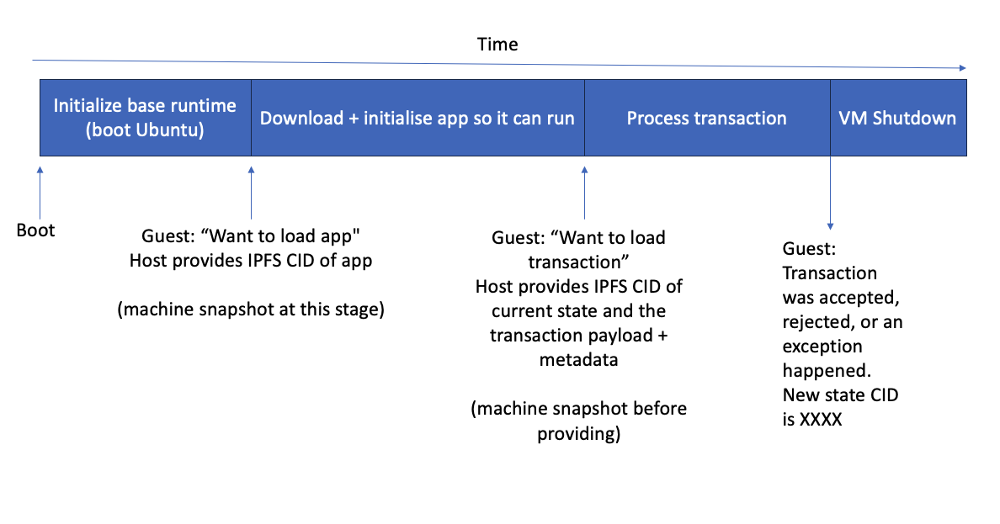

# Cartesi Lambada

# Come talk to us!

Read more about Cartesi - it's awesome, at https://cartesi.io

Join us on the Cartesi Discord in #cartesi-compute channel: https://discord.gg/pfXMwXDDfW

Happy to talk you through development steps!

# Why does Lambada matter?

There is an emerging environment characterized by a modular choice becoming possible, combining existing blockchains like Ethereum, alt-VMs, high-capacity decentralized sequencers, atomic transaction inclusion, data availability layers, re-staking mechanisms like Eigenlayer, co-processors, and zero-knowledge proofs. 

This environment will likely be fully in place by the end of Q1-start of Q2 2024 - and we think we will be ready to provide Cartesi’s core value in this environment. We already see the beginnings of this with the deployment of technologies like Celestia mainnet & RiscZero.

The current offering of Cartesi Rollups to developers is more suited towards those who’d deploy on existing Ethereum L1 or L2’s, host their infrastructure, and who have a deeper technical understanding, than fitting towards the millions of appchains envisioned with sequencers and data availability layers.

The Lambada stack is focused on enabling swift, iterative experimentation & deployment, and easier proof-of-concept development, aiming to efficiently deliver value to both end-users and developers in this dynamic and evolving technological landscape. 

The stack is meant to be simple, understandable, and possible to reason about by most participants in the ecosystem, to guide development, advocacy, and product direction.

# What makes Lambada different?

The main question posed by Lambada is: Does a world computer have to be so different than how modern cloud computing works today? Why does it need to feel so alien to developers?

## tl;dr

Build a container, wrap it in a chain description telling what sequencer to pick transactions from and what block height, and distribute the genesis block to IPFS and that’s your appchain. 

Finance inclusion of your appchain transactions by customers in sequencer blocks & computation of your state through hiring service providers for your appchain, paid through “reverse gas” model and a free tier model proposed. Submit transactions through a sequencer network. We’re no longer tied to restrictions of the EVM as sufficient ZK-based off-chain computation technology exists today to bypass EVM restrictions.

## World computer

What if we could build an even stronger world computer, by building on top of Ethereum and combining it with Cartesi? How would such a world computer look in 2024?

Lambada is built with the assumption that appchains (“app-specific rollups”) are sovereign and decide their service providers and should be able to migrate between them. There should be no binding to any particular service provider and it should be a marketplace - just tooling accessing the Cartesi protocol.

The governance of appchains will be initially more akin to association governance and eventually evolve into eventual self-owned, autonomous behavior or trust-minimized governance. And Cartesi as a protocol should facilitate this. We focus on appchains having inputs from sequencers as an abstraction rather than an EVM-specific inputs gathering method.

## Compute

The mental model of the execution of a transaction being computed in Lambada is not unlike that of an AWS Lambda function.

Reminding of what an AWS Lambda function is: You upload the Lambda function to AWS - it starts a VM running a base Linux runtime image inside, the app you want to run is placed on top of the runtime image, initializes, then executes one or more transactions, and then terminates. Heavy snapshotting of the VM state is done at init to make it able to not have to re-initialize all the time, caching it for low-latency access. From a developer's point of view, this environment is not that alien - it looks very similar to how they develop software locally.

An app built for Cartesi Lambada, would be published on IPFS for anyone who wants to compute the state of the appchain to retrieve it and would be running inside the Cartesi Machine, a RISC-V virtual machine, that runs a certain base image.

For us, our initial base image is reproducible (as in, yields same byte-by-byte image when you generate it) Ubuntu 22.04 RISC-V image with certain guest tools, Kubo IPFS daemon, Docker + it’s container build tools, ‘crun’, and initialization scripts installed. 

As it’s a pretty normal Ubuntu base image, we can also run this inside either real hardware, multi-core RISC-V emulators, etc for development & debugging purposes.

This effectively makes us able to publish a RISC-V Docker/OCI container to IPFS and have it become our app to be computed. Not so different from AWS Lambda, Heroku, fly.io, etc.

The software running inside the machine can communicate with the VM host through a special host-guest interface but is otherwise isolated. This allows the virtual machine to fetch blocks from the IPFS network and store IPFS blocks using it. 

We’ve developed a special datastore plugin for Kubo IPFS, that allows us to fetch and store IPFS blocks through this interface as well, effectively connecting the VM to IPFS.

As the app gets downloaded over IPFS, initializes, and signals over the interface that it waits for a transaction, a VM snapshot is made in the background of this point. The transaction is then processed by the app and the VM is terminated after signaling if the transaction was accepted, rejected or an exception happened - and the understanding by the app of the new state CID. As a new transaction comes in, we just resume from the VM snapshot made earlier, so we don’t need to re-initialize. 

Now that we have this in place, we have a very powerful compute primitive. This is immediately usable as a modular piece for being the backend for an Eigenlayer/restaking-based co-processor - taking just a state CID with an app CID inside, an input, and yielding either an error or a resulting state CID. It can feasibly be put inside an AWS Lambda function as well and backed by an IPFS storage cluster.

By building on this primitive, there’s a myriad of methods to generate computation certificates by which a reader could be convinced to a certain confidence level of a compute result - Localhost computation (maybe even in browser), Trust Me Bro APIs (Infura, Alchemy), AWS Nitro Enclave Attestations, Eigenlayer Co-processor signatures, Witness Chain Watch Towers, Cartesi in ZK w/ RiscZero, Dave dispute resolution protocol, etc. These are separate modules within Lambada that would build around the compute primitive.

The fact that computation is supposed to only be ‘after initialization of app’ until ‘transaction processed’ also makes it a lot easier to generate ZK proofs of the computation result.

## Appchains are sovereign

As mentioned above, we believe that appchains should be sovereign. Their current state should fully describe how the inputs from the sequencers they’ve picked as the source of their inputs should be processed and understood. It should be possible to point a Lambada node at an appchain genesis state and synchronize to the latest state of the appchain. All logic related to their execution should be described by the state and as much being computed inside the VM as possible.

As such, the state, as hosted in IPFS, contains a ‘chain info’ descriptor that specifies which sequencer to use - currently supported are Celestia and Espresso testnet, which VM id/namespace it has, and what sequencer block height it should listen to. When a transaction has finalized from the point of view of the sequencer network and is included in the sequencer blocks, this is when we consider that a state is final of an appchain as anyone can calculate the state based on the inputs, up to that point.

This yields another powerful primitive - the appchain subscription. When we subscribe to an appchain, it’s the act of downloading the genesis state and processing the transactions from the sequencer from the block height specified.

## State access & bridging

We are intentionally not focusing on state access in the Lambada compute primitive (such as GraphQL support) as this can be done through IPFS and IPLD. Indexes are up to the appchains themselves to provide or that of special indexing appchains that follow other appchains and generate an index as their state. 

IPFS access can be fronted by one or more CDNs, also in a CAR-file verifiable manner (https://specs.ipfs.tech/http-gateways/trustless-gateway/ ), so the only trust required is that of the state CID in a computation certificate and verifying what you get.

As appchains are sovereign, bridging messages into other machines (EVM, other Cartesi machines) is seen as running a client for the appchain within the VM of that chain and reading state of the appchain. 

In practice, this means that the VMs on these chains must be able to query the sequencer state and the security of that client is related to how that sequencer state makes it into the chain. For the sake of rapid evolution, we don’t force a particular format on this messaging from execution wrapper perspective. 

We make a hard assumption all chains can run limited general-purpose computation either through ZK technology like RiscZero or WASM or RISC-V and the lack of expressibility of EVM is not a concern. 

For appchains to receive information, it will depend on the information that the sequencer provides. For Espresso, it provides Ethereum L1 head information and latest finalized block (not subject to reorg), but no such thing exists for Celestia.

# Usage

Release build:

``docker build -t cartesi-lambada:1.0 .``

Debug build:

``docker build -t cartesi-lambada:1.0 --build-arg RELEASE= --build-arg RELEASE_DIR=debug .``

Start it up:

``docker run -p 127.0.0.1:3033:3033 -v $PWD/data:/data cartesi-lambada:1.0``

other terminal:

``curl -X POST -d 'echo hello world' -H "Content-Type: application/octet-stream" -v http://127.0.0.1:3033/compute/bafybeicdhhtwmgpnt7jugvlv3xtp2u4w4mkunpmg6txkkkjhpvnt2buyqa``

# Subscribe to chain and get information on state

Sample \"<appchain\>" is bafybeicdhhtwmgpnt7jugvlv3xtp2u4w4mkunpmg6txkkkjhpvnt2buyqa

Subscribe to a chain:
  
``curl http://127.0.0.1:3033/subscribe/<appchain>``
 
another terminal

``curl -X POST -d 'transaction data' -H "Content-type: application/octet-stream" http://127.0.0.1:3033/submit/<appchain>``

``curl http://127.0.0.1:3033/block/<appchain>/<height>``

``curl http://127.0.0.1:3033/latest/<appchain>``

# Building a devkit or for ARM64

ARM64:

``docker build -t cartesi-lambada:1.0 --build-arg ARCH=arm64 .``

Devkit:

``docker build -t cartesi-lambada-devkit:1.0 --build-arg DEVKIT=-devkit .``
 

Running devkit:

``docker run -p 8081:8081 --privileged cartesi-lambada-devkit:1.0``
